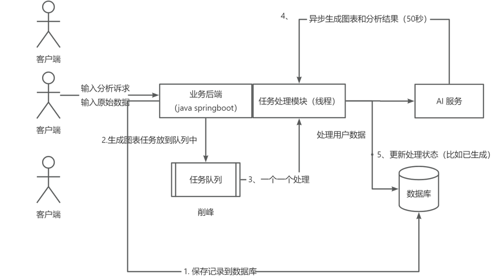
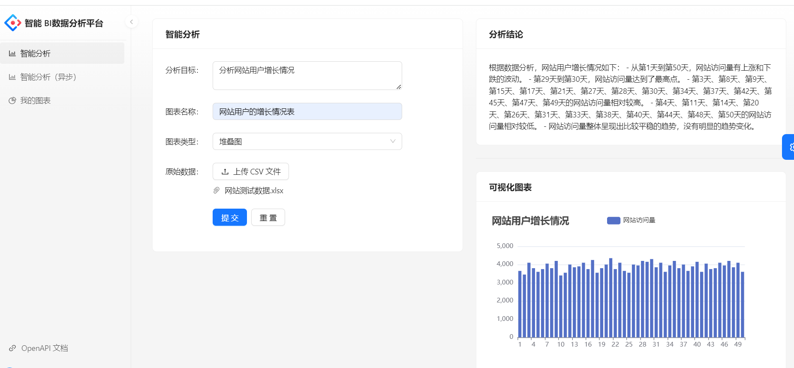
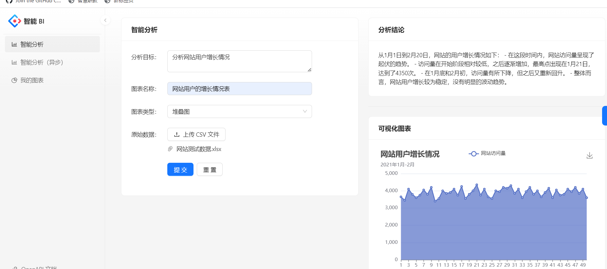
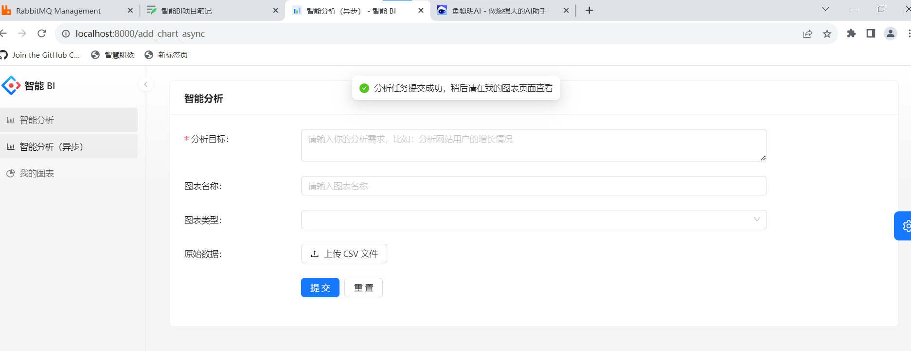
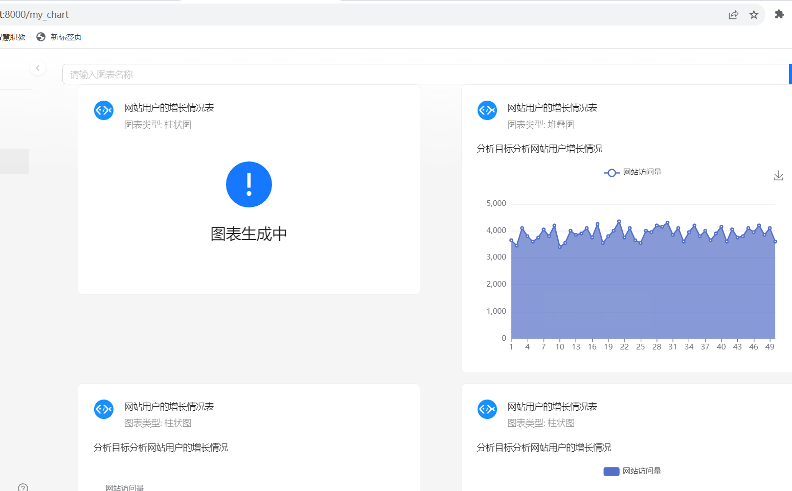
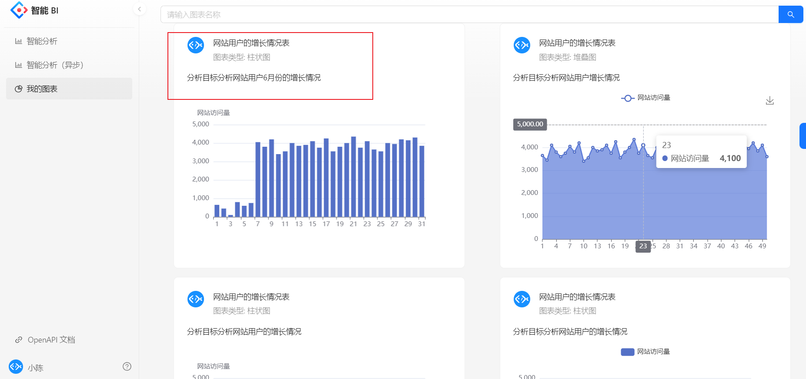

# 智能BI数据分析平台

> 项目模版出处来自[编程导航知识星球](https://yupi.icu/)
> [欢迎加入星球](https://yupi.icu/)

## 项目介绍
基于React+Spring Boot+MQ+AIGC的智能数据分析平台。
> AIGC ：Artificial Intelligence Generation Content(AI 生成内容)

区别于传统的BI，数据分析者只需要导入最原始的数据集，输入想要进行分析的目标，就能利用AI自动生成一个符合要求的图表以及分析结论。此外，还会有图表管理、异步生成、AI对话等功能。只需输入分析目标、原始数据和原始问题，利用AI就能一键生成可视化图表、分析结论和问题解答，大幅降低人工数据分析成本。

**优势：** 让不会数据分析的用户也可以通过输入目标快速完成数据分析，大幅节约人力成本，将会用到 AI 接口生成分析结果

## 项目架构图

基础架构：客户端输入分析诉求和原始数据，向业务后端发送请求。业务后端利用AI服务处理客户端数据，保持到数据库，并生成图表。处理后的数据由业务后端发送给AI服务，AI服务生成结果并返回给后端，最终将结果返回给客户端展示。

## 项目技术栈!
### 前端
1. React 18
2. Umi 4 前端框架
3. Ant Design Pro 5.x 脚手架
4. Ant Design 组件库
5. OpenAPI 代码生成：自动生成后端调用代码
6. EChart 图表生成

### 后端

1. Java Spring Boot
2. MySQL数据库
3. Redis：Redissson限流控制
4. MyBatis-Plus 数据库访问结构 + MyBatisX ： 根据数据库表自动生成
5. **RabbitMQ：消息队列**
6. AI SDK：AI接口开发
7. JDK 线程池及异步化
8. Easy Excel：表格数据处理
9. Swagger + Knife4j 项目文档
10. Hutool 、Apache Common Utils等工具库

## BI项目展示
### 同步分析数据生成图表

### 异步分析数据生成图表

### 图表管理界面

